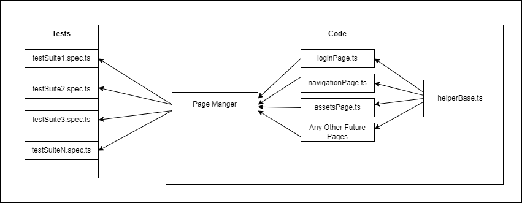

= Playwright Test Solution

This solution uses Playwright Test, a Node.js library to automate end-to-end tests with browsers.

== Setup

1. Install Node.js and npm.
2. Clone this repository.
3. Run `npm run setup` to install the dependencies.

== Running the Tests

Run `npx playwright test bulkEditWithMock.spec.ts  --project=chromium` to execute the tests.

== Test Structure

The tests are located in the `tests` directory. Each test file represents a test suite.

=== bulkEditWithMock.spec.ts

The `bulkEditWithMock.spec.ts` test suite demonstrates how to use Playwright's routing capabilities to mock network responses.

Here's a brief overview of what the test does:

1. Generates fake data for a certain number of assets using the `generator.generateFakeData(countOfAssets)` function.
2. Unroutes a specific route using `page.unroute(analyticListViewRoute)`.
3. Sets up a new route that fulfills requests to the unrouted route with the generated fake data.
4. Clicks a "Save and Apply" button using `pm.instanceAssetsPage().clickButtonSaveAndApply()`.
5. Waits for a certain amount of time using `page.waitForTimeout(10000)`.
6. Retrieves all present assets using `pm.instanceAssetsPage().getAllPresentAssets()`.
7. Asserts that the number of present assets is equal to the expected number using `expect(presentDomainNameAfterUpdate).toHaveLength(250)`.
8. Asserts that the present assets are equal to the expected assets using `expect(presentDomainNameAfterUpdate).toEqual(presentDomainNameAfterUpdate)`.

== Page Objects

The tests use the Page Object Model design pattern to abstract away the details of the UI. The page objects are located in the `page-objects` directory.

Each page object represents a page (or part of a page) and provides methods to interact with that page. For example, the `instanceAssetsPage` page object provides methods to click the "Save and Apply" button and to get all present assets.

== Mocking Network Responses

The tests use Playwright's routing capabilities to mock network responses. This allows the tests to control the data that the application receives and to test how the application behaves with different data.

In the `bulkEditWithMock.spec.ts` test suite, the `page.route` method is used to set up a new route that fulfills requests to a specific route with generated fake data. The `page.unroute` method is used to remove the original route, so that the application receives the fake data instead of the real data.

== Generating Fake Data

The tests use the `generator.generateFakeData` function to generate fake data for a certain number of assets. This allows the tests to control the data that the application receives and to test how the application behaves with different data.
